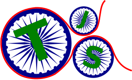

## This project has been renamed, please switch to using DM-Tools below.

- [Dev Mentor Tools](https://github.com/devmentor416/devmentor)


[](https://greenkeeper.io/)

# TSCLI - TypeScript Project creator



The _TSCLI_ project is in the process of becoming a general purpose CLI project generator for TypeScript based code.

Emphasis is put into encouraging the use of best practices and the best tools. I expect things to evolve overtime and settle to something the general practitioner will be happy with.

Currently the _TSCLI_ default project template is being used to solidify concepts and setup.

TSCLI uses only TypeScript to build the project, I plan to add Webpack support once I am satifisty the basic project templates.

## Project Types

The following basic project type that can be created using TSCLI are:

1. Default (TypeScript Node.js with static Website)
1. TypeScript Node.js (Zero web)
1. Puse JavaScript Node.js (ES6, Zero compile wth static Website)

## Installing TSCLI

```sh
npm install -g tscli
```

## Creating a Project

Start playing with the demo starter project now, the generated source code is located in the project `src/` sub-folder.

```sh
cli new demo
cd demo
```

_Note_: If you are using _Yarn_ over _NPM_, continue to work with _Yarn_, the TSCLI generated project will use Yarn before NPM if it is available on your system.

## Running a Node.js program

To simply run a Node.js program written in TypeScript you can type:

```sh
npm start
```

This will perform a clean build and run the demo program from the `build/` folder. The demo application log will be produced in the `logs/` sub-folder under the project root.

### Running and watching during development

You can also continue to watch and run a Node.js based program during development. To do this open three terminals.

* Terminal 1: The build terminal.
* Terminal 2: Run the compiled Node.js code.
* Terminal 3: Watch test results.

**Important!**: If you are encounter strange build errors in one of the terminal, it could be due to linting errors or compiler error. This unfortunately does not make it to the terminal since these operations are running through another NPM script. So to quickly see what is failing, from another terminal type, `npm run build`, this will quickly let you see the problem.

#### Terminal One

This will run the build in watch mode.

```sh
npm run dev
```

Wait for the build to complete before issuing the next command.

#### Terminal Two

This will run the Node.js program whenever new files are copied into the `build/` folder from the compiler.

```sh
npm run devwatch
```

#### Terminal Three

This runs the unit tests in watch mode when file in the `build/` folder are updated.

```sh
npm run testwatch
```

There is a delay added before the Node.js program is executed, this is to prevent premature re-running of code if multiple files are being copied to the `build/` folder. You can change the delay from the `devwatch` script (see file `package.json`) by altering the value passed using the `--delay-start` switch.

## Benefits

Here are the benefits you will enjoy right out of the gate:

* Quick start
* Best practices
* Build system
* Code in TypeScript
* Code TypeScript Modules
* HTML live edit and preview
* Error logging
* Code linting
* Code formatting
* Unit testing
* Code coverage
* Document generation
* Git commit hooks
* Continuous integration (under research)

## TypeScript development

### Source code

Place all TypeScript source code under the folder, `src/`, they will be picked up from here and compiled to the, `build/` folder under the project root.

You are free to create addition folders and sub-folders under, `src/`, the compiler will recursively find and compile all TypeScript code.

All TypeScript code is compiled to _ES5_ JavaScript. The target JavaScript code can be changed from the [TypeScript configuration](https://www.typescriptlang.org/docs/handbook/tsconfig-json.html) file, `tsconfig.json`.

Some of the things you may want to configure:

* Files to compile
* Folders to include
* Folders to exclude
* Target compiled output
* Source map (Needed for debugging)
* Module system (Use commonjs for Node)
* Output file

Supported compiled targets include: `ES3, ES5, ES6, ES2016, ES2017`.

See [compiler options](https://www.typescriptlang.org/docs/handbook/compiler-options.html) for more details.

### Building

To compile the TypeScript code, use the following command to start the build process:

```sh
npm run build
```

### Warning

The `build/` folder and all sub-folders within it will be deleted to insure a clean build is performed each time. Do not place any files you will need later in the `build/` folder.

### Library code (Modules)

Place any module or library source code that you write under the, `src/lib/`, sub-folder. The compiled source code will be output to the, `build/lib/`, sub-folder.

### Formatting the code

It is good practice to format the source code, so it conforms to a uniform structure. Avoid squabbles about style. To format the TypeScript code, type:

```sh
npm run format
```

_Note_: When the _TSCLI_ generated project is built, the source code will be automatically formatted. This will also happen before source code is committed to _Git_.

### Linting

To validate the project TypeScript source code, use the following command:

```sh
npm run check
```

_Note_: The TypeScript source code is run through a linter (_TSLint_) before a build and before it is committed to the Git repository. Any errors encountered must be fixed before the Git commit is allowed to proceed.

**Important!**: I have noticed, one in a while the git hooks will continue to fail when there is nothing really wrong. If you suspect this is the case, the easy fix is to delete the `node_modules` folder. Follow it with a `npm install` or simply type `yarn` and then try to commit or push the code again.

### Testing

Testing is done using _Ava_, the [test methods](https://github.com/avajs/ava#assertions) are simple and easy to learn.

_Ava_ makes testing simple. Code is easy to read since it is just JavaScript, this avoids the need to context switch to BDD syntax. Plus anyone who knows JavaScript will be able to write test code immediately.

I firmly believe less time should be put into writing test code and having more time to write production code. Ava delivers on this by keeping the setup and test writing to a bare minimum. I believe _Ava_ is the best option for writing unit test for JavaScript based code.

The test code should be _co-located_ with the production source code. As a best practice, place tests under a sub-folder called `test/`.

Pay attention to how the test source file is named: `test.<file>.ts`. So if you have a file called, `filter.ts`, the test file should be named, `test.filter.ts`.

To run the test, type:

```sh
npm test
```

_Note_: Running the test will cause a fresh build to be kicked-off. Once the build finishes, all the unit tests will be run.

## Static Web development

If you want to hack around with HTML, CSS and try things out quick. Start the project in _web_ mode using the following command:

```sh
npm run web
```

This will run the build first and then open a web browser on port 3000, and load the HTML page, `index.html` located in the `src/` sub-folder.

Any changes made to `index.html` will automatically update and browser on save. You do not need to keep hitting _refresh_ on the browser.

The website uses lite-server, which is based on Browsersync to run a local development web-server and keeps all browsers listening to it in sync. This means it is possible to have multiple browsers listening to the server.

On how to configure the setup, read the [Browsersync options](https://browsersync.io/docs/options).

Basic configurations setting you may be interested in are:

* files
* server
* proxy
* logLevel
* port

The default Browsersync UI web address is: `http://localhost:3001/`.

### Browsersync Asset fetching

With Browsersync, having to serve addition CSS and JavaScript files, make sure to add their path in routes. Something similar to like this:

```js
  "server": {
    baseDir: "src",
    routes: {
      "/node_modules/tachyons/css":"node_modules/tachyons/css"
    }
```

This will allow including `<script>` assets from the index.html file like this:

```html
<head>
  <link rel="stylesheet" href="./node_modules/tachyons/css/tachyons.min.css">
</head>
```

## Test coverage

Test coverage is done when test is run using `nyc`. The test coverage result is displayed to the console after the results of the unit tests. A folder called `coverage/` will be created under the project root. It will hold the results of the code coverage from the test run. Of interest to you will be the HTML report. It is a nice way to see what code was covered and what code was not by the unit tests.

To configure the test coverage, make changes to the `nyc` settings found in the file `package.json`.

## Create a Node.js JavaScript project

If you want to develop in plain JavaScript, or develop a ES6 Node.js based project, this is now supported. It is also good for quickly testing out code and not getting slowed down by the compile step.

You will need the latest version of Node.js for ES6 and beyond support, otherwise plain JavaScript will continue to work.

```sh
cli new demo --type js
npm install
```

_Note_: You may also use `-t` which is the short-form for `--type`.

The following NPM commands are supported:

NPM script|Description
----------|-----------
check|Run code through linter (jslint).|
dev|Run in watch mode.|
doc|Generate doc files (jsdocs).|
format|Format the source code.|
node:debug|Start debugger, requires Chrome.|
start|Run the Node.js program.|
test|Run Unit testing (Ava).|

The plain JavaScript generated file has a development mode. It will run the _Entry_ file (`main.js`) using Node.js each time the source code is updated. You can develop and see the output from the _terminal_ to test out code quickly.

```sh
npm run dev
```

### TypeScript Node ES5

If you need to use ES5 Nodejs support with TypeScript here are the following change you need to make.

Add the following two lines under compilerOptions to `tsconfig.json` and `tsconfig.test.json`.

```js
"compilerOptions": {
  "target": "es5",
  "lib": ["es2015", "dom"]
}
```

## Contributors wanted

I am open to help and learn from the community. Feel free to create a PR, reach out to me to discuss ideas, and help out with this project.

If you have never done a commit before, have no idea what a PR is, do not worry. I am open to help first timers :)

## Where to start

Not sure where to get started. Here are two suggested starting points:

1. Start by looking at open issues to fix.
1. Look at [Launchpad](https://tree.taiga.io/project/rajinder-yadav-launchpad/kanban?kanban-status=1068326) project tasks for things to help out with.

### Issues

If you know your way around, look for issues marked, _help wanted_.

If you are someone new to helping out on a Open Source project, look for something really easy to get your feet wet.

## Coding guideline

Read the [coding guideline](https://github.com/rajinder-yadav/tscli/wiki/Coding-guideline) found in the wiki.
